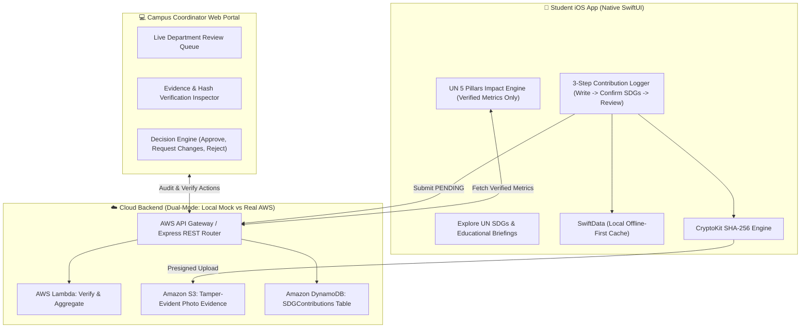

# 🌱 SDG Wallet — Verified Sustainability Credit & Impact Platform

> **Vision**: An end-to-end sustainability credit and verification ecosystem connecting student climate actions with department coordinators. **Designed to reduce greenwashing through human verification, tamper-evident integrity verification, and immutable audit trails.**

[](https://developer.apple.com/swift/)
[](https://aws.amazon.com/)
[](https://aws.amazon.com/dynamodb/)
[](https://github.com/ranswalaakash/Sustainability-Development-Goals-Wallet)

---

## 🏛️ System Architecture



---

## ⚙️ Operational Environments: Local Mock vs. Real AWS Deployment

To ensure smooth evaluation during demos and full scalability in production, the project supports two operational modes:

| Dimension | 🛠️ Local Development / Mock Mode | ☁️ Real AWS Cloud Production Mode |
| :--- | :--- | :--- |
| **API Endpoint** | `http://localhost:3001` (Node.js Express) | `https://<api-id>.execute-api.us-east-1.amazonaws.com` |
| **Evidence Storage** | Local static mock endpoint / local storage | **Amazon S3** (`sdg-wallet-evidence-*`) via pre-signed `PUT` URLs |
| **Database** | Local JSON store (`coordinator-portal/data/contributions.json`) | **Amazon DynamoDB** (`SDGContributions` table) |
| **Execution** | Local background server | **AWS Lambda** (Node.js 20.x runtime via SAM template) |
| **Best For** | Fast UI iteration, offline development, local demos | Production campus-wide deployments, high-concurrency audits |

---

## 🔄 End-to-End Workflow

1. **Student Action Logging (iOS App)**:
   * Student opens the **Contribute** tab and taps `+`.
   * Follows the clean **3-step flow**: Write narrative & attach photo -> Confirm matching official UN SDG print icons (`SDG_1` to `SDG_17`) -> Review & Save.
2. **Tamper-Evident Integrity Verification**:
   * The client uses **Apple CryptoKit** to compute a **SHA-256 cryptographic hash** of the attached image before upload.
   * Requests an S3 presigned URL (`POST /api/contributions/presign`) and uploads photo proof directly.
   * Metadata is submitted with status `PENDING`.
3. **Coordinator Review & Audit (Web Portal)**:
   * The coordinator visits `http://localhost:3001` (or the hosted portal).
   * Opens the **Audit Modal** to inspect the photo, location coordinates, S3 key, and SHA-256 cryptographic checksum.
   * Validates or fine-tunes quantitative metric outputs (trees planted, kg waste recycled, kWh saved, volunteer hours).
   * Clicks **"Approve & Issue SDG Credits"** or sends revision feedback.
4. **Live Synchronization & Verified Impact Calculation**:
   * The iOS app automatically synchronizes status on screen appear and pull-to-refresh.
   * The contribution switches to **"Verified by Coordinator"** with a green seal badge.
   * The **Impact Tab** recalculates the student's **UN 5 Pillars** (*People, Planet, Prosperity, Peace, Partnership*) and aggregated impact metrics exclusively from verified records.

---

## 🚀 Getting Started

### 1. Running the Local Coordinator Portal & Mock API
```bash
# Navigate to the coordinator portal directory
cd coordinator-portal

# Install dependencies
npm install

# Start the server on port 3001
npm start
```
Open **`http://localhost:3001`** in any web browser.

---

### 2. Deploying to Real AWS (Production)
```bash
# Navigate to the aws directory
cd aws

# Build the SAM serverless template
sam build

# Deploy to your AWS account
sam deploy --guided
```
After deployment, copy the output `HttpApiUrl` and configure it in the iOS client (`APIService.swift`).

---

### 3. Running the iOS Application
1. Open `SDG Wallet.xcodeproj` in **Xcode 15+**.
2. Select an iOS Simulator (iOS 17+) or connected iPhone.
3. Build and Run (`Cmd + R`).

---

## 📂 Repository Structure

```
.
├── SDG Wallet/                     # Native iOS Application
│   ├── SDG_WalletApp.swift         # App Entry Point & SwiftData container
│   ├── ContentView.swift           # 3-Tab Root (Explore, Contribute, Impact)
│   ├── Models/
│   │   ├── DataModels.swift        # SwiftData Contribution model & enums
│   │   └── Models_data.swift       # Official UN SDG goals & target metadata
│   ├── Services/
│   │   ├── APIService.swift        # Actor-isolated REST client with AWS fallback
│   │   └── CryptoUtils.swift       # SHA-256 tamper-evident checksum generator
│   ├── Views/
│   │   ├── Explore/                # UN SDG interactive exploration
│   │   ├── Contribute/             # 3-Step Contribution flow & Activity Detail
│   │   └── Impact/                 # UN 5 Pillars scoring & shareable cards
│   └── Assets.xcassets/
│       └── E SDG Icons PRINT/      # Official UN SDG print icon assets (SDG 1-17)
│
├── coordinator-portal/             # Standalone Faculty Web Portal
│   ├── server.js                   # Express REST server (Local/Mock Mode)
│   ├── public/
│   │   ├── index.html              # Coordinator audit dashboard
│   │   └── app.js                  # Review modal, live filters & decision logic
│   └── data/
│       └── contributions.json      # Local persistent store
│
├── aws/                            # Production AWS Serverless Stack
│   ├── template.yaml               # AWS SAM CloudFormation template
│   ├── README.md                   # AWS deployment guide
│   └── lambda/                     # Node.js 20.x Lambda handlers
│       ├── presign.js              # S3 presigned URL generation
│       ├── contributions.js        # DynamoDB CRUD & listing
│       ├── verify.js               # Coordinator verification handler
│       └── impact.js               # UN 5 Pillars & metrics aggregation
│
└── README.md                       # Comprehensive Project Documentation
```

---

## 🔒 Security & Anti-Fraud Architecture

* **Tamper-Evident Integrity Verification**: Every photo evidence item is hashed client-side with SHA-256 before upload.
* **Separation of Concerns**: Students cannot self-verify actions; all official impact metrics require review by a verified department coordinator.
* **Immutable Audit Trail**: All coordinator reviews record the reviewer ID, timestamp, and modification log.
